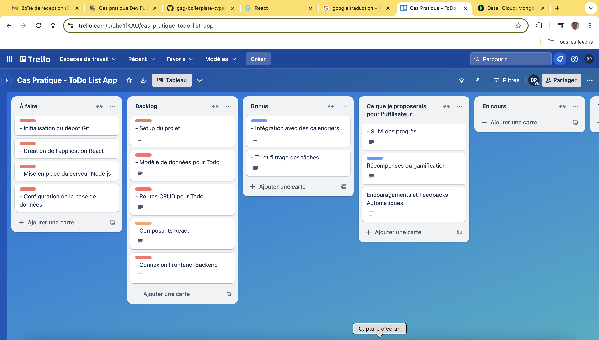
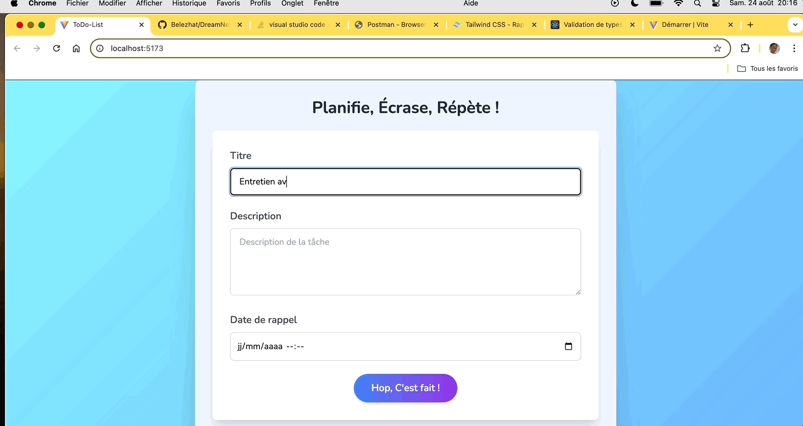
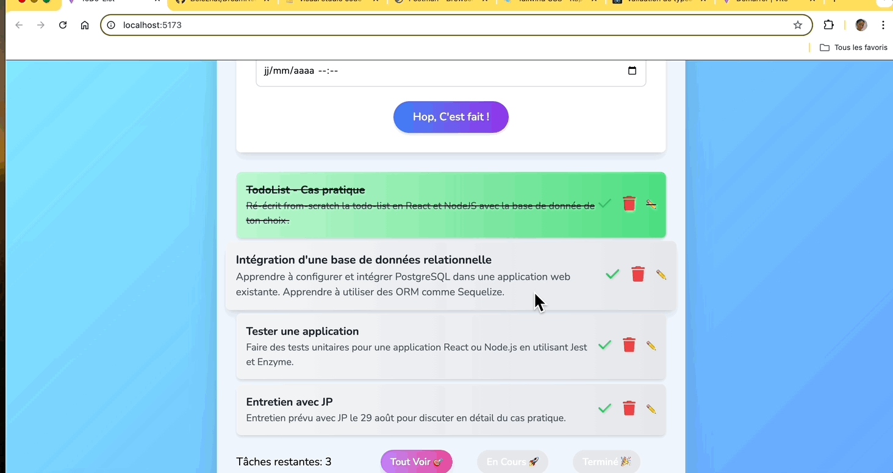
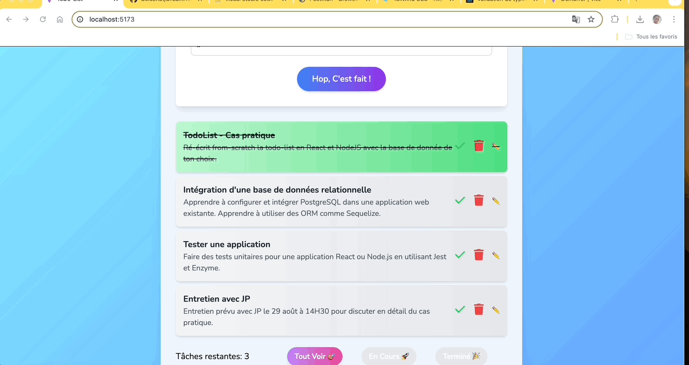
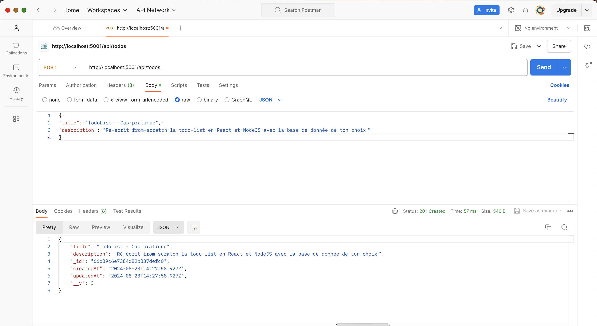

# TodoList-App

## Description

Ce projet est une application de gestion de tâches développée en utilisant React pour le frontend et Node.js pour le backend, avec une base de données MongoDB pour le stockage des données. C'est un excellent cas pratique pour comprendre les bases de React et comment construire une application web complète en utilisant une architecture moderne. Idéal pour les développeurs débutants qui souhaitent se familiariser avec le développement web moderne et comprendre comment assembler un projet complet de bout en bout.

## Objectifs pédagogiques

1. Comprendre les bases de React : Ce projet vous permettra de vous     familiariser avec les concepts fondamentaux de React, tels que les composants, les hooks (comme useState et useEffect), la gestion des états locaux et globaux, ainsi que les interactions utilisateur.

2. Interaction avec une API backend : Apprenez à créer une API RESTful avec Node.js et Express, et à interagir avec cette API depuis le frontend en utilisant fetch pour effectuer des requêtes HTTP (GET, POST, PUT, DELETE).

3. Gestion d'une base de données NoSQL : Ce projet vous montre comment connecter une application Node.js à MongoDB, comment effectuer des opérations CRUD (Create, Read, Update, Delete) sur des données, et comment structurer vos modèles de données avec Mongoose.

4. Pratiques de développement : Le projet intègre de bonnes pratiques de développement telles que la séparation des préoccupations avec l'utilisation de contrôleurs pour gérer la logique métier.

## Fonctionnalités

- 🗂 CRUD Complet : Création, lecture, mise à jour et suppression de tâches.
- ⏰ Rappels : Configuration de rappels pour des tâches spécifiques.
- 🛠 Filtrage des tâches : Affichage des tâches en cours, terminées ou toutes les tâches.
- 🖌 Interface Utilisateur Moderne : Conçue avec Tailwind CSS pour une expérience utilisateur fluide et réactive.
- 📅 Gestion des Dates de Rappel : Les rappels sont validés pour s'assurer qu'ils sont définis dans le futur.
- 🔔 Notifications : Notifications pour rappeler les tâches en attente.

## Structure du Projet

```
TODO-APP/
├── backend/
│   ├── controllers/
│   ├── models/
│   ├── routes/
│   ├── .env
│   └── index.js
├── frontend/
│   ├── public/
│   ├── src/
│   │   ├── components/
│   │   ├── hooks/
│   │   └── App.jsx
│   └── index.html
├── package.json
└── README.md
```

## Captures d'écran








